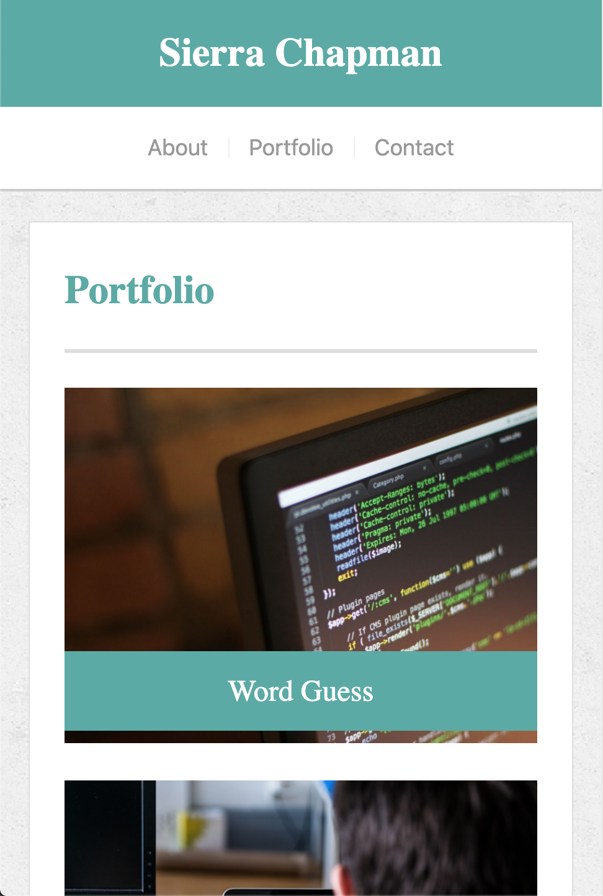
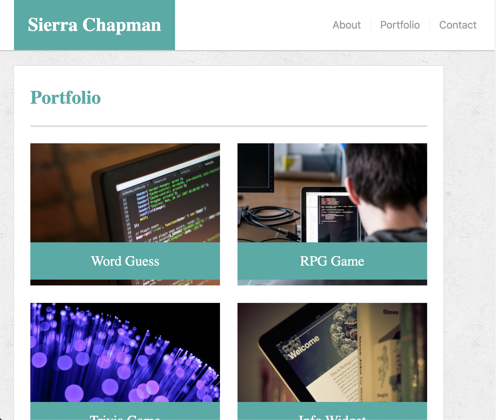

# A Responsive Portfolio

This project is a portfolio website that responds to the size of the window in which it is being viewed. This is primarily accomplished using [Bootstrap](https://getbootstrap.com/)'s grid system and responsive containers. 

## Example of Responsive Behavior

An example of a responsive part of the layout of the page is the navigation bar. The navigation bar consists of a heading stating the portfolio owner's name and a navigation menu containing links to each page. When viewport is large, these components are side-by-size, but when the viewport is small, the layout changes so that the navigation menu is below the heading to avoid crowding.

This is accomplished using the Bootstrap grid system by placing these two components in separate columns within the same row. The heading is placed within a div that is assigned four bootstrap classes: `
`. When the browser is small, the `col-12` class makes the heading containing the portfolio owner's name take up the whole row, forcing the navigation menu into a second row. The `p-0` class eliminates padding so that the contents of the `div`, which have the teal background color, can stretch accross the entire row. When the browswer window is medium or larger, the `col-md-auto` and `px-md-4` classes come into effect, making the column width change to the width of its contents and adding a fixed amount of padding to the left and right sides. This makes space for the navigation menu in the first row, causes the teal background color to shrink to a box around the heading, and adds some white space to the left of the teal box.

## Built with

* [HTML](https://developer.mozilla.org/en-US/docs/Web/HTML)
* [CSS](https://developer.mozilla.org/en-US/docs/Web/CSS)
* [Bootstrap](https://getbootstrap.com/)

## Deployed Link

* [See Live Site](https://sierrachapman.github.io/responsive-portfolio/)

## Authors

* **Sierra Chapman** 
    - [Portfolio Site](#)
    - [Github](https://github.com/SierraChapman)
    - [LinkedIn](https://www.linkedin.com/in/sierra-chapman)

## Acknowledgments

* The look for this website was designed by Trilogy Education Services, a 2U, Inc.
* The placeholder images used on the portfolio page were downloaded from [PlaceIMG.com](https://placeimg.com/).